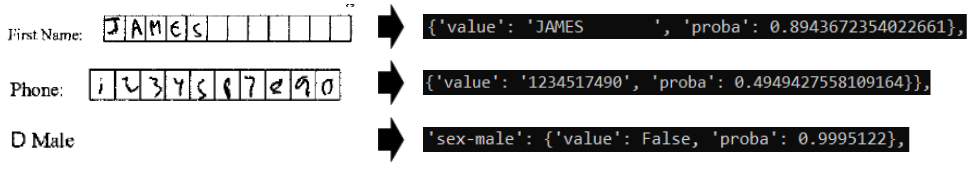
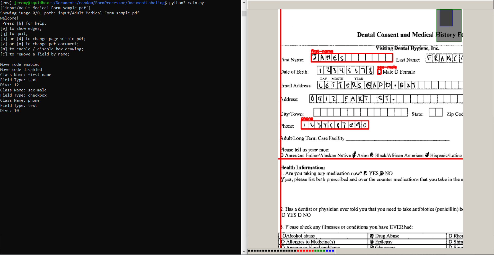

## FormProcessor

Project to process PDF forms with handwitten fields. Converts checkboxes and gridded text fields to .json objects containing predicted transcription and confidence of prediction.

***********************************

### DocumentLabeling

Tool for creating .json temlpates for PDF forms.

### DocumentProcessing

Tool for converting PDF forms into .json objects.

***********************************

### Example:

